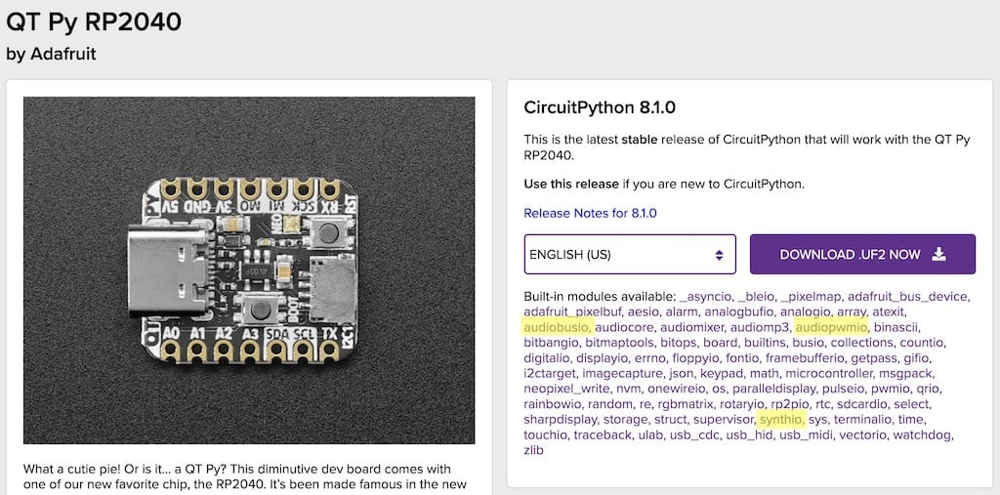
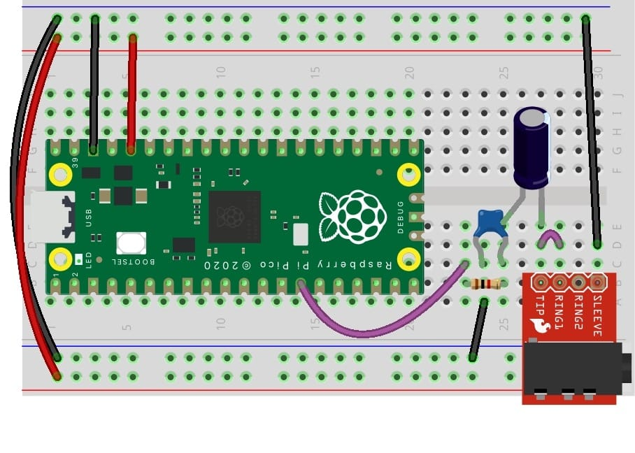
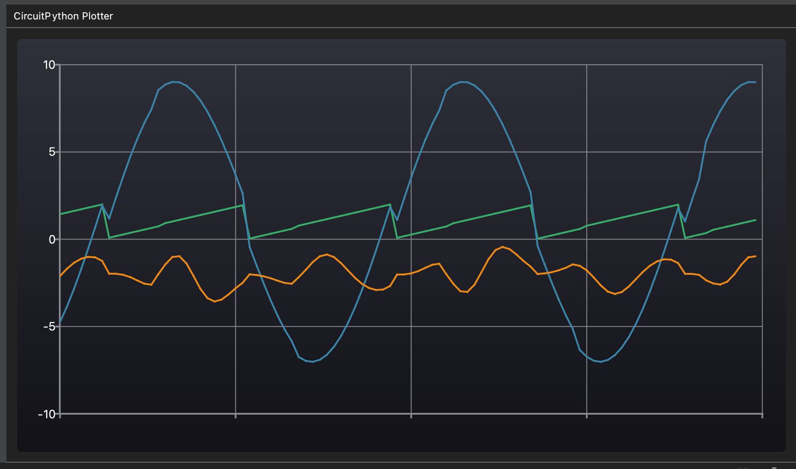

Synthio Tricks
===============

<!--ts-->
   * [What is synthio?](#what-is-synthio)
   * [Getting started](#getting-started)
      * [Which boards does synthio work on?](#which-boards-does-synthio-work-on)
      * [Audio out circuits](#audio-out-circuits)
      * [Play a note every second](#play-a-note-every-second)
      * [Play a chord](#play-a-chord)
      * [USB MIDI Input](#usb-midi-input)
      * [Serial MIDI Input](#serial-midi-input)
      * [Using AudioMixer for adjustable volume &amp; fewer glitches](#using-audiomixer-for-adjustable-volume--fewer-glitches)
   * [Basic Synth Techniques](#basic-synth-techniques)
      * [Amplitude envelopes](#amplitude-envelopes)
         * [Envelope for entire synth](#envelope-for-entire-synth)
         * [Using synthio.Note for per-note velocity envelopes](#using-synthionote-for-per-note-velocity-envelopes)
      * [LFOs](#lfos)
         * [Vibrato: pitch bend with LFO](#vibrato-pitch-bend-with-lfo)
         * [Tremolo: volume change with LFO](#tremolo-volume-change-with-lfo)
      * [Waveforms](#waveforms)
         * [Making your own waves](#making-your-own-waves)
         * [Wavetable morphing](#wavetable-morphing)
   * [Advanced Techniques](#advanced-techniques)
      * [Keeping track of pressed notes](#keeping-track-of-pressed-notes)
      * [Turn WAV files info oscillators](#turn-wav-files-info-oscillators)
      * [Detuning oscillators for fatter sound](#detuning-oscillators-for-fatter-sound)
      * [Using LFO values in your own code](#using-lfo-values-in-your-own-code)
      * [Using synthio.Math with synthio.LFO](#using-synthiomath-with-synthiolfo)
      * [Drum synthesis](#drum-synthesis)
   * [Example "Patches"](#example-patches)
      * [Arcade sounds](#arcade-sounds)
      * [Bass synth arpeggiator](#bass-synth-arpeggiator)
      * [Drone synth with 8 oscillators](#drone-synth-with-8-oscillators)
      * [THX "Deep Note"](#thx-deep-note)

<!-- Added by: tod, at: Thu Jun  1 10:59:15 PDT 2023 -->

<!--te-->

## What is `synthio`?

- CircuitPython [core library](https://docs.circuitpython.org/en/latest/shared-bindings/synthio/index.html)
   available since 8.2.0-beta0 and still in development!
- Features:
  - Polyphonic (11 to 24? oscillator) & stereo, 16-bit, with adjustable sample rate
  - Oscillators are wavetable-based, wtih real-time adjustable wavetables
  - ADSR [amplitude envelope](https://docs.circuitpython.org/en/latest/shared-bindings/synthio/index.html#synthio.Envelope) per oscillator
  - Oscillator [ring modulation](https://docs.circuitpython.org/en/latest/shared-bindings/synthio/index.html#synthio.Note.ring_frequency) w/ customizable ring oscillator wavetable
  - Extensive [LFO system](https://docs.circuitpython.org/en/latest/shared-bindings/synthio/index.html#synthio.LFO)
    - multiple LFOs per oscillator (amplitude, panning, pitch bend, ring mod)
    - LFOs can repeat or run once (becoming a kind of envelope)
    - Each LFO can have a custom wavetable with linear interpolation
    - LFO outputs can be used by user code
    - LFOs can plug into one another
    - Customizable LFO wavetables and can be applied to your own code
  - [Math blocks](https://docs.circuitpython.org/en/latest/shared-bindings/synthio/index.html#synthio.Math)
     with [14 three-term Math operations](https://docs.circuitpython.org/en/latest/shared-bindings/synthio/index.html#synthio.Math) to adjust LFO ranges, offsets, scales
  - Utility functions to easily convert from [MIDI note to frequency](https://docs.circuitpython.org/en/latest/shared-bindings/synthio/index.html#synthio.midi_to_hz) or [V/Oct modular to frequency](https://docs.circuitpython.org/en/latest/shared-bindings/synthio/index.html#synthio.voct_to_hz)
  - Plugs into existing the [`AudioMixer`](https://docs.circuitpython.org/en/latest/shared-bindings/audiomixer/index.html) system for use alongside `audiocore.WaveFile` sample playing

## Getting started

### Which boards does `synthio` work on?

Since `synthio` is built in to CircuitPython and CirPy has varying support on different boards,
you will need to check your board's "Built-in modules avialble" section on
[circuitpython.org/downloads](https://circuitpython.org/downloads).
Here's what that section looks like for the QTPy RP2040:



Note that `synthio` is there, and two audio output methods. CircuitPython supports three
different audio output techniques, with varying availability:

- [`audioio.AudioOut`](https://docs.circuitpython.org/en/latest/shared-bindings/audioio/index.html)
   -- output to built-in DAC (usually SAMD51 "M4" boards)
- [`audiobusio.I2SOut`](https://docs.circuitpython.org/en/latest/shared-bindings/audiobusio/index.html)
   -- output to external I2S DAC board (RP2040, ESP32S2/3, SAMD51 "M4", nRF52)
- [`audiopwmio.PWMAudioOut`](https://docs.circuitpython.org/en/latest/shared-bindings/audiopwmio/index.html)
   -- output PWM that needs external RC filter to convert to audio (RP2040, nRF52)

Notice that not all audio output techniques are supported everywhere.
An I2S DAC board is the most widely supported, and highest quality.
Even so, this guide will focus mostly on PWMAudioOut on Pico RP2040 because it's quick and simple,
but any of the above will work.

###  Audio out circuits


* Pico w/ RC filter and `audiopwmio.PWMAudioOut`

  THe Pico can output a mono sound using PWM (~10-bit resolution) with an RC-filter.
  (R1=1k, C1=100nF, [Sparkfun TRRS](https://www.sparkfun.com/products/11570))

  

  Note: this is a very minimal RC filter stage that doesn't do DC-blocking
  and proper line driving, but is strong enough to power many headphones.
  See [here for a more complete RC filter circuit](https://www.youtube.com/watch?v=rwPTpMuvSXg).


*  Pico w/ [I2S PCM5102](https://amzn.to/3MGOTJH) and `audiobusio.I2SOut`

   An I2S DAC board is capable of stereo CD-quality sound and they're very affordable.
   The line out is also strong enough to drive many headphones too, but I usually feed
   the output into a portable bluetooth speaker with line in.

      


### Play a note every second

Use one of the above circuits, we can now hear what `synthio` is doing.

```py
import board, time
import synthio

# for PWM audio with an RC filter
import audiopwmio
audio = audiopwmio.PWMAudioOut(board.GP10)
# for I2S audio with external I2S DAC board
#import audiobusio
#audio = audiobusio.I2SOut(bit_clock=board.GP11, word_select=board.GP12, data=board.GP10)

synth = synthio.Synthesizer(sample_rate=22050)
audio.play(synth)

while True:
    synth.press(65) # midi note 65 = F4
    time.sleep(0.5)
    synth.release(65) # release the note we pressed
    time.sleep(0.5)
```

We'll be assuming PWMAudioOut in the examples below, but if you're using an I2S DAC instead,
the `audio` line would look like the commented out part above. The particular choices for the three
signals depends on the chip, and CircuitPython will tell you in the REPL is a particular pin combination
isn't supported. On RP2040-based boards like the Pico,
[many pin combos are available](https://learn.adafruit.com/adafruit-i2s-stereo-decoder-uda1334a/circuitpython-wiring-test#wheres-my-i2s-2995476).

### Play a chord

To play notes simultaneously, send a list of notes to `synth.press()`.
Here we send a 3-note list of [MIDI note numbers](http://notebook.zoeblade.com/Pitches.html)
that represent musical notes (F4, A4, C5), an F-major chord.

```py
import board, time
import audiopwmio
import synthio

audio = audiopwmio.PWMAudioOut(board.GP10)
synth = synthio.Synthesizer(sample_rate=22050)
audio.play(synth)

while True:
  synth.press( (65,69,72) ) # midi notes 65,69,72  = F4, A4, C5
  time.sleep(0.5)
  synth.release( (65,69,72) )
  time.sleep(0.5)
```


### USB MIDI Input

How about a MIDI synth in 20 lines of CircuitPython?

(To use with a USB MIDI keyboard, plug both the keyboard & CirPy device into a computer,
and on the computer run a DAW like Ardour, LMMS, Ableton Live, etc,
to forward MIDI from keyboard to CirPy)

```py
import board
import audiopwmio
import synthio
import usb_midi
import adafruit_midi
from adafruit_midi.note_on import NoteOn
from adafruit_midi.note_off import NoteOff

audio = audiopwmio.PWMAudioOut(board.GP10)
synth = synthio.Synthesizer(sample_rate=22050)
audio.play(synth)

midi = adafruit_midi.MIDI(midi_in=usb_midi.ports[0], in_channel=0 )

while True:
    msg = midi.receive()
    if isinstance(msg, NoteOn) and msg.velocity != 0:
        print("noteOn: ", msg.note, "vel:", msg.velocity)
        synth.press( msg.note )
    elif isinstance(msg,NoteOff) or isinstance(msg,NoteOn) and msg.velocity==0:
        print("noteOff:", msg.note, "vel:", msg.velocity)
        synth.release( msg.note )

```

### Serial MIDI Input

The same as above, but replace the `usb_midi` with a `busio.UART`

```py
# ... as before
import busio
uart = busio.UART(tx=board.TX, rx=board.RX, timeout=0.001)
midi = adafruit_midi.MIDI(midi_in=uart, in_channel=0 )
while True:
  msg = midi.receive()
  # ... as before
```

### Using AudioMixer for adjustable volume & fewer glitches

Stick an AudioMixer in between `audio` and `synth` and we get three benefits:
- Volume control over the entire synth
- Can plug other players (like `WaveFile`) to play samples simultaneously
- An audio buffer that helps eliminate glitches from other I/O

```py
import audiomixer
audio = audiopwmio.PWMAudioOut(board.GP10)
mixer = audiomixer.Mixer(sample_rate=22050, buffer_size=2048)
synth = synthio.Synthesizer(sample_rate=22050)
audio.play(mixer)
mixer.voice[0].play(synth)
mixer.voice[0].level = 0.25  # 25% volume might be better
```

Setting the AudioMixer `buffer_size` argument is handy for reducing giltches that happen when the chip is
doing other work like updating a display reading I2C sensors. Increase the buffer to eliminate glitches
but it does increase latency.

## Basic Synth Techniques

There are a handful of common techniques used to make a raw electronic waveform sound more like musical
instruments or sounds in the real world. Here are some of them.

### Amplitude envelopes

The amplitude envelope describes how a sound's loudness changes over time.
In synthesizers, [ADSR envelopes](https://en.wikipedia.org/wiki/Envelope_(music))
are used to describe that change. In `synthio`, you get the standard ADSR parameters,
and a default fast attack, max sustain level, fast release envelope.

#### Envelope for entire synth

To create your own envelope with a slower attack and release time, and apply it to every note:


```py
import board, time, audiopwmio, synthio
audio = audiopwmio.PWMAudioOut(board.GP10)
synth = synthio.Synthesizer(sample_rate=22050)
audio.play(synth)

amp_env_slow = synthio.Envelope(attack_time=0.2, release_time=0.8, sustain_level=1.0)
amp_env_fast = synthio.Envelope(attack_time=0.01, release_time=0.2, sustain_level=0.5)
synth.envelope = amp_env_slow  # could also set in synth constructor

while True:
  synth.press(65) # midi note 65 = F4
  time.sleep(0.5)
  synth.release(65)
  time.sleep(1.0)
  synth.envelope = amp_env_fast
  synth.press(65)
  time.sleep(0.5)
  synth.release(65)
  time.sleep(1.0)
  synth.envelope = amp_env_slow
```

#### Using `synthio.Note` for per-note velocity envelopes

To give you more control over each oscillator, `synthio.Note` lets you override
the default envelope and waveform of your `synth` with per-note versions.
For instance, you can create a new envelope based on incoming MIDI note velocity to
make a more expressive instrument. You will have to convert MIDI notes to frequency by hand,
but synthio provides a helper for that.

```py
import board, time, audiopwmio, synthio, random
audio = audiopwmio.PWMAudioOut(board.GP10)
synth = synthio.Synthesizer(sample_rate=22050)
audio.play(synth)

while True:
    midi_note = 65
    velocity = random.choice( (1, 0.1, 0.5) )  # 3 different fake velocity values 0.0-1.0
    print("vel:",velocity)
    amp_env = synthio.Envelope( attack_time=0.1 + 0.6*(1-velocity),  # high velocity, short attack
                                release_time=0.1 + 0.9*(1-velocity) ) # low velocity, long release
    note = synthio.Note( synthio.midi_to_hz(midi_note), envelope=amp_env )
    synth.press(note) # press with note object
    time.sleep(0.5)
    synth.release(note) # must release with same note object
    time.sleep(2.0)
```

The choice of how you scale velocity to attack times, sustain levels and so on,
is dependent on your application.

For an example of how to use this with MIDI velocity,
see [synthio_midi_synth.py](https://gist.github.com/todbot/96a654c5fa27625147d65c45c8bfd47b)


### LFOs

LFOs (Low-Frequency Oscillators) were named back when it was very different
to build an audio-rate oscillator vs an oscillator that changed over a few seconds.
In synthesis, LFOs are often used to "automate" the knob twiddling one would do to perform an instrument.
`synthio.LFO` is a flexible LFO system that can perform just about any kind of
automated twiddling you can imagine.

The waveforms for `synthio.LFO` can be any waveform (even the same waveforms used for oscillators),
and the default waveform is a sine wave.

To show the flexibilty of LFOs, here's a quick non-sound exmaple that prints out three different LFOs.

```py
# orig from @jepler 15 May 2023 11:23a in #circuitpython-dev/synthio
import board, time, audiopwmio, synthio
import ulab.numpy as np

SAMPLE_SIZE = 1024
SAMPLE_VOLUME = 32767
ramp = np.linspace(-SAMPLE_VOLUME, SAMPLE_VOLUME, SAMPLE_SIZE, endpoint=False, dtype=np.int16)
sine = np.array(
    np.sin(np.linspace(0, 2 * np.pi, SAMPLE_SIZE, endpoint=False)) * SAMPLE_VOLUME,
    dtype=np.int16,
)

l = synthio.LFO(ramp, rate=4, offset=1)
m = synthio.LFO(sine, rate=2, offset=l, scale=8)
n = synthio.LFO(sine, rate=m, offset=-2, scale=l)
lfos = [l, m, n]

audio = audiopwmio.PWMAudioOut(board.GP10)
synth = synthio.Synthesizer(sample_rate=22050)  # not outputting sound, just its LFO ticking
audio.play(synth)
synth.blocks[:] = lfos  # attach LFOs to synth so they get ticked

while True:
    print("(", ",".join(str(lfo.value) for lfo in lfos), ")" )
    time.sleep(0.01)
```

If you run this with the [Mu plotter](https://codewith.mu/en/tutorials/1.2/plotter)
you'll see all three LFOs, and you can see how the "n" LFO's rate is being changed by the "m" LFO.




#### Vibrato: pitch bend with LFO

Some instruments like voice and violin can vary their pitch while sounding a note.
To emulate that, we can use an LFO.  Here we create an LFO with a rate of 5 Hz and amplitude of 0.5% max.
For each note, we apply that LFO to the note's `bend` property to create vibrato.

If you'd like the LFO to start over on each note on, do `lfo.retrigger()`.

```py
import board, time, audiopwmio, synthio
audio = audiopwmio.PWMAudioOut(board.GP10)
synth = synthio.Synthesizer(sample_rate=22050)
audio.play(synth)

lfo = synthio.LFO(rate=5, scale=0.05)  # 5 Hz lfo at 0.5%

while True:
    midi_note = 65
    note = synthio.Note( synthio.midi_to_hz(midi_note), bend=lfo )
    synth.press(note)
    time.sleep(1.0)
    synth.release(note)
    time.sleep(1.0)

```

#### Tremolo: volume change with LFO

Similarly, we can create rhythmic changes in loudness with an LFO attached to `note.amplitude`.
And since each note can get their own LFO, you can make little "songs" with just a few notes.
Here's a [demo video of this "LFO song"](https://www.youtube.com/watch?v=m_ALNCWXor0).


```py
import board, time, audiopwmio, synthio
audio = audiopwmio.PWMAudioOut(board.GP10)
synth = synthio.Synthesizer(sample_rate=22050)
audio.play(synth)

lfo_tremo1 = synthio.LFO(rate=3)  # 3 Hz for fastest note
lfo_tremo2 = synthio.LFO(rate=2)  # 2 Hz for middle note
lfo_tremo3 = synthio.LFO(rate=1)  # 1 Hz for lower note
lfo_tremo4 = synthio.LFO(rate=0.75) # 0.75 Hz for lowest bass note

midi_note = 65
note1 = synthio.Note( synthio.midi_to_hz(midi_note), amplitude=lfo_tremo1)
note2 = synthio.Note( synthio.midi_to_hz(midi_note-7), amplitude=lfo_tremo2)
note3 = synthio.Note( synthio.midi_to_hz(midi_note-12), amplitude=lfo_tremo3)
note4 = synthio.Note( synthio.midi_to_hz(midi_note-24), amplitude=lfo_tremo4)
synth.press( (note1, note2, note3, note4) )

while True:
    print("hi, we're just groovin")
    time.sleep(1)
```


### Waveforms

The default oscillator waveform in `synthio.Synthesizer` is a square-wave with 50% duty-cycle.
But synthio will accept any buffer of data and treat it as a single-cycle waveform.
One of the easiest ways to make the waveform buffers that synthio expects is to use
[`ulab.numpy`](https://learn.adafruit.com/ulab-crunch-numbers-fast-with-circuitpython/ulab-numpy-phrasebook).
The numpy functions also have useful tools like `np.linspace()` to generate a line through a number space
and trig functions like `np.sin()`. Once you have a waveform, set it with either `synth.waveform`
or creating a new `synthio.Note(waveform=...)`

#### Making your own waves

Here's an example that creates two new waveforms: a sine way and a sawtooth wave, and then plays
them a two-note chord, first with sine waves, then with sawtooth waves.

```py
import board, time, audiopwmio, synthio
import ulab.numpy as np
audio = audiopwmio.PWMAudioOut(board.GP10)
synth = synthio.Synthesizer(sample_rate=22050)
audio.play(synth)
# create sine & sawtooth single-cycle waveforms to act as oscillators
SAMPLE_SIZE = 512
SAMPLE_VOLUME = 32000  # 0-32767
wave_sine = np.array(np.sin(np.linspace(0, 2*np.pi, SAMPLE_SIZE, endpoint=False)) * SAMPLE_VOLUME, dtype=np.int16)
wave_saw = np.linspace(SAMPLE_VOLUME, -SAMPLE_VOLUME, num=SAMPLE_SIZE, dtype=np.int16)

midi_note = 65
my_wave = wave_saw
while True:
    # create notes using those waveforms
    note1 = synthio.Note( synthio.midi_to_hz(midi_note), waveform=my_wave)
    note2 = synthio.Note( synthio.midi_to_hz(midi_note-7), waveform=my_wave)
    synth.press(note1)
    time.sleep(0.5)
    synth.press(note2)
    time.sleep(1)
    synth.release( (note1,note2) )
    time.sleep(0.1)
    my_wave = wave_sine if my_wave is wave_saw else wave_saw  # toggle waveform
```

#### Wavetable morphing


## Advanced Techniques


### Keeping track of pressed notes

When passing in `synthio.Note` objects instead of MIDI note numbers to `synth.press()`,  your code
must remmeber that object so it can pass it into `synth.release()` to properly stop it playing.
One way to do this is with a Python dict where the key is whatever your unique identifier is
(e.g. MIDI note number here for simplicity) and the value is the note object.

```py

# setup as before to get `synth` & `midi` objects
notes_pressed = {}  # which notes currently being pressed, key=midi note, val=note object
while True:
    msg = midi.receive()
    if isinstance(msg, NoteOn) and msg.velocity != 0:  # NoteOn
        note = synthio.Note(frequency=synthio.midi_to_hz(msg.note), waveform=wave_saw, #..etc )
        synthio.press(note)
        notes_pressed[msg.note] = note
    elif isinstance(msg,NoteOff) or isinstance(msg,NoteOn) and msg.velocity==0:  # NoteOff
        note = notes_pressed.get(msg.note, None) # let's us get back None w/o try/except
        if note:
            syntho.release(note)
```


### Turn WAV files info oscillators


```py
# orig from @jepler 31 May 2023 1:34p #circuitpython-dev/synthio
import adafruit_wave

# reads in entire wave
def read_waveform(filename):
    with adafruit_wave.open(filename) as w:
        if w.getsampwidth() != 2 or w.getnchannels() != 1:
            raise ValueError("unsupported format")
        return memoryview(w.readframes(w.getnframes())).cast('h')

# this verion lets you lerp() it to mix w/ another wave
def read_waveform_ulab(filename):
    with adafruit_wave.open(filename) as w:
        if w.getsampwidth() != 2 or w.getnchannels() != 1:
            raise ValueError("unsupported format")
        return np.frombuffer(w.readframes(w.getnframes()), dtype=np.int16)


my_wave = read_waveform("AKWF_granular_0001.wav")

```

### Detuning oscillators for fatter sound

Since we have fine-grained control over a note's frequency with `note.frequency`, this means we can do a
common technique for getting a "fatter" sound.

```py
import board, time, audiopwmio, synthio
audio = audiopwmio.PWMAudioOut(board.TX)
synth = synthio.Synthesizer(sample_rate=22050)
audio.play(synth)

detune = 0.005  # how much to detune, 0.7% here
num_oscs = 1
midi_note = 45
while True:
    print("num_oscs:", num_oscs)
    notes = []  # holds note objs being pressed
    # simple detune, always detunes up
    for i in range(num_oscs):
        f = synthio.midi_to_hz(midi_note) * (1 + i*detune)
        notes.append( synthio.Note(frequency=f) )
    synth.press(notes)
    time.sleep(1)
    synth.release(notes)
    time.sleep(0.1)
    # increment number of detuned oscillators
    num_oscs = num_oscs+1 if num_oscs < 5 else 1
```

### Using LFO values in your own code

### Using `synthio.Math` with `synthio.LFO`

### Drum synthesis


## Example "Patches"

### Arcade sounds

### Bass synth arpeggiator

### Drone synth with 8 oscillators

### THX "Deep Note"


###
